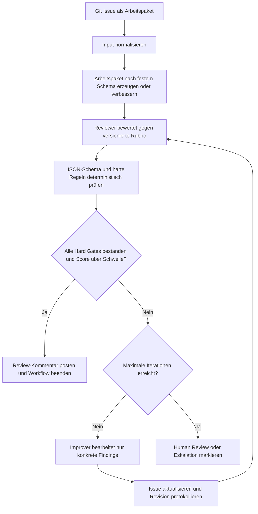

# Arbeitspakete mit KI erstellen, reviewen und iterativ verbessern

## Kurzantwort

Es gibt keine einzelne, allgemein etablierte Sammlung, die exakt den kompletten Ablauf "Git-Issue → Review → Verbesserung → erneutes Review → Stop bei Qualitätsschwelle" abdeckt. Die passenden Bausteine liegen vor allem in drei Bereichen:

1. **Spec-Driven Development** für die Erstellung und Zerlegung von Arbeitspaketen
2. **Agent Skills** für wiederverwendbare Workflows und feste Qualitätsregeln
3. **LLM-Evals und Rubrics** für reproduzierbare Reviews und Regressionstests

Für einen n8n-Workflow ist es sinnvoller, diese Bausteine zu kombinieren, statt einen einzelnen Mega-Prompt zu verwenden.

---

## Geeignete Anlaufstellen

| Ressource | Eignung für den Anwendungsfall |
|---|---|
| [GitHub Spec Kit](https://github.com/github/spec-kit) | Methodischer Ausgangspunkt für `specify`, `plan`, `tasks`, `implement`, `analyze`, `checklist` und `converge`. Besonders passend für strukturierte Anforderungen und Arbeitspakete. |
| [Addy Osmani – Agent Skills](https://github.com/addyosmani/agent-skills) | Sammlung strukturierter Engineering-Workflows, unter anderem für Spec-Driven Development, Planning, Task Breakdown, Code Review und Quality. |
| [Anthropic Agent Skills](https://github.com/anthropics/skills) | Gute Referenz für den Aufbau wiederverwendbarer Skills mit `SKILL.md`, Anweisungen, Beispielen und optionalen Ressourcen. |
| [VoltAgent – Awesome Agent Skills](https://github.com/VoltAgent/awesome-agent-skills) | Große kuratierte Sammlung von Skills für GitHub, Issue-Erstellung, Reviews, Testing und Requirements Engineering. |
| [Promptfoo](https://github.com/promptfoo/promptfoo) | Infrastruktur für Prompt- und Modellvergleiche, Regressionstests, automatische Evaluations und CI/CD-Qualitätsgates. |
| [Prompt Engineering Guide](https://www.promptingguide.ai/) | Referenz für Prompt Chaining, strukturierte Ausgaben, Evaluations- und Agentenmuster. |
| [GitHub Issue Forms](https://docs.github.com/en/communities/using-templates-to-encourage-useful-issues-and-pull-requests/syntax-for-issue-forms) | Pflichtfelder, Dropdowns, Validierungen, Labels und Standardwerte für die Eingabe neuer Arbeitspakete. |

### Empfohlene Priorität

1. **GitHub Spec Kit** als methodische Vorlage
2. **Eigene versionierte Review-Rubric** für die Qualitätsbewertung
3. **JSON-Schema** für maschinenlesbare Reviews
4. **n8n** als deterministische Orchestrierung
5. **Promptfoo** oder ein eigenes Testskript für Regressionstests

---

## Zielarchitektur für den n8n-Workflow

Der Workflow sollte vier klar getrennte Verantwortlichkeiten haben:

```text
work-package-skill.md
review-rubric.yaml
review-output-schema.json
improver-prompt.md
```

### Rollenaufteilung

- **Generator:** Erstellt ein Arbeitspaket anhand des definierten Schemas.
- **Reviewer:** Bewertet ausschließlich gegen die versionierte Rubric.
- **Improver:** Behebt ausschließlich die Findings des Reviews.
- **n8n-Code:** Berechnet Score, prüft Schema und entscheidet über die nächste Iteration.

Wichtig: Review und Verbesserung sollten in getrennten LLM-Aufrufen stattfinden. Ein einzelner Aufruf, der gleichzeitig bewertet und verbessert, neigt zur Selbstbestätigung.

---

## 1. Skill für Arbeitspakete

Ein Skill sollte kein allgemeiner Prompt wie "Schreibe ein gutes Arbeitspaket" sein, sondern einen Prozess mit Regeln, Prüfschritten und Exit-Kriterien definieren.

Beispiel für `work-package-skill.md`:

```markdown
# Work Package Skill

## Ziel
Erzeuge ein umsetzbares Arbeitspaket für ein Git Issue.

## Grundregeln
- Keine Annahmen als Fakten darstellen.
- Fehlende Informationen als offene Frage markieren.
- Ein Arbeitspaket beschreibt ein klares Ergebnis.
- Scope, Nicht-Scope und Abnahmekriterien müssen getrennt sein.
- Abnahmekriterien müssen prüfbar sein.
- Keine technischen Details erfinden, wenn sie nicht aus dem Kontext hervorgehen.
- Bestehende gültige Inhalte bei einer Überarbeitung erhalten.

## Pflichtabschnitte
1. Ziel und Nutzen
2. Kontext
3. Scope
4. Nicht im Scope
5. Ergebnis / Deliverables
6. Abnahmekriterien
7. Abhängigkeiten
8. Annahmen
9. Risiken
10. Offene Fragen
11. Definition of Done
```
```

### Zusätzliche Regeln für die Überarbeitung

- Nur konkrete Review-Findings bearbeiten.
- Akzeptierte Inhalte nicht ohne Grund umformulieren.
- Fehlende Informationen nicht erfinden.
- Widersprüche zwischen Issue, Review und Änderung sichtbar markieren.
- Die Überschriften und ihre Reihenfolge beibehalten.

---

## 2. Versionierte Review-Rubric

Die Rubric sollte einen Gesamtscore in einzelne Kriterien zerlegen. Für jedes Kriterium sollte es feste Bewertungsanker geben.

Beispiel für `review-rubric.yaml`:

```yaml
rubric_version: "1.0"

criteria:
  - id: objective
    name: "Ziel und Nutzen"
    weight: 15
    scale:
      0: "Kein klares Ziel erkennbar"
      1: "Ziel vorhanden, aber unpräzise oder ohne nachvollziehbaren Nutzen"
      2: "Ziel und erwarteter Nutzen sind klar beschrieben"

  - id: scope
    name: "Scope und Abgrenzung"
    weight: 15
    scale:
      0: "Scope fehlt oder ist widersprüchlich"
      1: "Scope teilweise erkennbar"
      2: "In Scope und Out of Scope sind klar abgegrenzt"

  - id: deliverables
    name: "Ergebnis und Deliverables"
    weight: 15
    scale:
      0: "Kein konkretes Ergebnis"
      1: "Ergebnis grob beschrieben"
      2: "Ergebnis ist konkret und überprüfbar"

  - id: acceptance_criteria
    name: "Abnahmekriterien"
    weight: 25
    scale:
      0: "Keine Abnahmekriterien"
      1: "Abnahmekriterien vorhanden, aber teilweise nicht prüfbar"
      2: "Alle wesentlichen Kriterien sind eindeutig und prüfbar"

  - id: dependencies
    name: "Abhängigkeiten und Annahmen"
    weight: 10
    scale:
      0: "Relevante Abhängigkeiten fehlen"
      1: "Teilweise dokumentiert"
      2: "Relevante Abhängigkeiten und Annahmen sind nachvollziehbar"

  - id: risks
    name: "Risiken und offene Fragen"
    weight: 10
    scale:
      0: "Keine Risiken oder offenen Fragen trotz erkennbarer Unsicherheit"
      1: "Teilweise dokumentiert"
      2: "Relevante Risiken und offene Fragen sind konkret benannt"

  - id: size
    name: "Größe und Umsetzbarkeit"
    weight: 10
    scale:
      0: "Zu groß, zu unscharf oder nicht realistisch umsetzbar"
      1: "Grundsätzlich umsetzbar, aber weitere Zerlegung sinnvoll"
      2: "In einem angemessenen Arbeitsumfang umsetzbar"

hard_gates:
  - id: has_objective
    description: "Ein konkretes Ziel muss vorhanden sein"
  - id: has_acceptance_criteria
    description: "Mindestens ein prüfbares Abnahmekriterium muss vorhanden sein"
  - id: no_blocking_open_question
    description: "Keine unbeantwortete Frage darf die Umsetzung vollständig blockieren"
  - id: valid_structure
    description: "Alle Pflichtabschnitte müssen vorhanden sein"

threshold:
  minimum_score: 80
  maximum_iterations: 4
```

### Rubric-Grundsätze

- Kriterien sollten möglichst unabhängig voneinander sein.
- Score-Anker müssen konkrete Beispiele oder klare Zustände beschreiben.
- Kritische Anforderungen gehören als Hard Gate zusätzlich in die Rubric.
- Die Rubric muss versioniert werden.
- Änderungen an der Rubric sollten gegen ein Golden Set getestet werden.

INVEST ist eine gute Inspirationsquelle für Arbeitspakete: Independent, Negotiable, Valuable, Estimable, Small und Testable. Für technische oder interne Arbeitspakete sollten zusätzlich Scope, Abhängigkeiten, Risiken und technische Randbedingungen berücksichtigt werden.

---

## 3. Maschinenlesbarer Review-Output

Der Reviewer sollte zunächst JSON und nicht direkt Markdown erzeugen. Das Markdown für den GitHub-Kommentar kann anschließend deterministisch aus dem JSON gebaut werden.

Beispiel für `review-output-schema.json` beziehungsweise einen möglichen Output:

```json
{
  "schema_version": "1.0",
  "decision": "REVISE",
  "criteria": [
    {
      "id": "objective",
      "score": 2,
      "max_score": 2,
      "status": "PASS",
      "evidence": "Das Ziel beschreibt die Bereitstellung eines automatisierten Review-Prozesses.",
      "finding": null
    },
    {
      "id": "acceptance_criteria",
      "score": 1,
      "max_score": 2,
      "status": "REVISE",
      "evidence": "Abnahmekriterien sind vorhanden, enthalten aber keine konkreten Prüfergebnisse.",
      "finding": "Es fehlt eine eindeutige Aussage, wie die erfolgreiche Umsetzung verifiziert wird."
    }
  ],
  "hard_gates": [
    {
      "id": "has_objective",
      "passed": true
    },
    {
      "id": "has_acceptance_criteria",
      "passed": false,
      "reason": "Mindestens ein Kriterium ist nicht objektiv prüfbar."
    }
  ],
  "findings": [
    {
      "id": "AC-001",
      "severity": "MAJOR",
      "section": "Abnahmekriterien",
      "problem": "Das Kriterium ist zu allgemein.",
      "required_change": "Ein messbares Prüfergebnis ergänzen."
    }
  ],
  "next_action": "IMPROVE"
}
```

### Score-Berechnung

Den Gesamtscore sollte n8n selbst berechnen. Der LLM-Reviewer liefert nur die Einzelscores und Begründungen. Dadurch kann das Modell keinen falschen Gesamtscore ausgeben.

Beispiel bei einer Skala von 0 bis 2:

```text
Kriteriumsscore = score / max_score * weight
Gesamtscore = Summe aller Kriteriumsscores
```

Die Berechnung, Rundung und Schwellenprüfung gehören in einen Code-Node oder in deterministische n8n-Nodes.

---

## 4. Improver-Prompt

Der Improver sollte das komplette Issue nicht frei neu erfinden, sondern nur auf die Findings reagieren.

Beispiel für `improver-prompt.md`:

```markdown
# Improver Instructions

Überarbeite das Arbeitspaket ausschließlich anhand der übergebenen Review-Findings.

Regeln:

1. Akzeptierte Inhalte dürfen nicht ohne Grund verändert werden.
2. Nur Findings mit Severity BLOCKER oder MAJOR müssen zwingend behoben werden.
3. MINOR-Findings dürfen verbessert werden, wenn sie keine neuen Annahmen erzeugen.
4. Fehlende Informationen niemals erfinden.
5. Wenn eine Information erforderlich ist, aber nicht vorliegt:
   - als offene Frage aufnehmen
   - nicht selbst entscheiden
6. Die festgelegten Markdown-Überschriften und die Reihenfolge beibehalten.
7. Gib nur das vollständige aktualisierte Arbeitspaket zurück.
8. Gib keinen Review-Kommentar und keine Bewertung zurück.
```
```

---

## Empfohlener Workflow



### Ablauf in n8n

1. **GitHub Trigger:** Issue wird erstellt oder geändert.
2. **Normalisierung:** Titel, Beschreibung, Labels und vorhandene Metadaten extrahieren.
3. **LLM-Aufruf Generator/Improver:** Arbeitspaket nach festem Schema erzeugen oder überarbeiten.
4. **LLM-Aufruf Reviewer:** Issue gegen die Rubric bewerten und ausschließlich JSON liefern.
5. **JSON-Validierung:** Output gegen das erwartete Schema prüfen.
6. **Score-Node:** Gesamtscore aus den Einzelscores berechnen.
7. **Hard-Gate-Node:** Kritische Mindestanforderungen deterministisch prüfen.
8. **Entscheidung:** Bestanden, weiter verbessern oder zur manuellen Prüfung eskalieren.
9. **GitHub-Kommentar:** Review als Markdown posten.
10. **Issue-Update:** Nur bei erforderlicher Verbesserung den Inhalt aktualisieren.

---

## Deterministische Prüfungen in n8n

Folgende Aspekte sollten nicht dem LLM überlassen werden:

- Ist der Output gültiges JSON?
- Sind alle Pflichtfelder vorhanden?
- Sind alle Pflichtüberschriften im Issue enthalten?
- Ist der Score korrekt aus den Einzelscores berechnet?
- Sind alle Hard Gates erfüllt?
- Ist die maximale Iterationszahl erreicht?
- Hat sich der Issue-Inhalt tatsächlich verändert?
- Wurde dasselbe Finding mehrfach erfolglos bearbeitet?
- Ist der Output zu lang?
- Gibt es nicht erlaubte oder unbekannte Felder?
- Stimmen `rubric_version`, `prompt_version` und `model_version`?

---

## Bessere Abbruchlogik als nur ein Score

Nicht nur mit `score > 80` stoppen. Besser ist eine Kombination aus Score, Hard Gates und Findings:

```text
PASS =
  weighted_score >= 80
  AND all_hard_gates_passed
  AND no_blocker_findings
  AND no_major_finding_without_evidence
```

Ein Arbeitspaket kann einen hohen Score erreichen, obwohl ein kritisches Abnahmekriterium fehlt. Deshalb müssen Hard Gates und Score getrennt behandelt werden.

Zusätzlich sollte immer eine maximale Anzahl von Iterationen definiert werden:

```text
max_iterations = 4
```

Nach Erreichen dieser Grenze sollte der Workflow nicht weiterlaufen, sondern beispielsweise folgenden Status setzen:

```text
status = HUMAN_REVIEW_REQUIRED
```

So werden Endlosschleifen, Score-Pingpong und semantische Kleinständerungen vermieden.

---

## Deterministisch erzeugter Review-Kommentar

Der GitHub-Kommentar kann aus dem JSON-Review gebaut werden:

```markdown
## 🤖 Arbeitspaket-Review

- **Revision:** 3
- **Entscheidung:** REVISE
- **Score:** 72/100
- **Schwelle:** 80/100
- **Rubrik:** 1.0

### Ergebnis

Das Arbeitspaket ist grundsätzlich verständlich, aber die Abnahmekriterien sind noch nicht ausreichend prüfbar.

### Kriterien

| Kriterium | Score | Status |
|---|---:|---|
| Ziel und Nutzen | 2/2 | ✅ |
| Scope und Abgrenzung | 2/2 | ✅ |
| Ergebnis / Deliverables | 2/2 | ✅ |
| Abnahmekriterien | 1/2 | ⚠️ |
| Abhängigkeiten | 1/2 | ⚠️ |

### Findings

- **MAJOR – AC-001:** Das Abnahmekriterium ist nicht objektiv prüfbar.
- **MINOR – RISK-001:** Ein erkennbares Betriebsrisiko ist nicht dokumentiert.

### Nächster Schritt

Das Arbeitspaket wird anhand der Findings überarbeitet.
```
```

---

## Metadaten im GitHub-Issue

Zusätzlich können maschinenlesbare Metadaten im Issue gespeichert werden:

```markdown
<!-- ai-work-package-meta
{
  "revision": 3,
  "rubric_version": "1.0",
  "prompt_version": "2026-07-01",
  "status": "REVISE",
  "score": 72,
  "workflow_run_id": "..."
}
-->
```

Damit kann n8n zuverlässig erkennen, welche Revision zuletzt bewertet wurde.

---

## Maßnahmen für Konsistenz

### 1. Alle Bestandteile versionieren

Nicht nur den Prompt versionieren, sondern gemeinsam:

```text
prompt_version
skill_version
rubric_version
model_version
workflow_version
```

### 2. Beispiele verwenden

Ein eigener Beispielbestand hilft bei der Kalibrierung:

```text
examples/
  excellent-work-package.md
  weak-work-package.md
  ambiguous-acceptance-criteria.md
  over-scoped-work-package.md
  missing-dependencies.md
```

Die Beispiele sollten gute und schlechte Fälle enthalten und möglichst echte, anonymisierte Arbeitspakete repräsentieren.

### 3. Golden Set aufbauen

Für Regressionstests sollten etwa 20 bis 50 echte, anonymisierte Arbeitspakete gesammelt werden:

```json
{
  "input_issue": "...",
  "expected_findings": [
    "missing_acceptance_criteria",
    "scope_too_large"
  ],
  "expected_decision": "REVISE"
}
```

Diese Fälle werden bei jeder Änderung von Prompt, Rubric oder Modell erneut geprüft.

### 4. Reviewer und Improver trennen

Der Reviewer sollte nicht gleichzeitig die eigene Verbesserung bewerten. Nutze getrennte Aufrufe und möglichst einen frischen Kontext.

### 5. Menschliche Kalibrierung einplanen

Gerade am Anfang sollten mehrere Reviews durch Menschen gegengeprüft werden. Die Rubric und Bewertungsanker können anschließend anhand realer Fehlentscheidungen verbessert werden.

---

## Konkrete Startversion

Für einen ersten belastbaren Prototypen empfiehlt sich folgende Kombination:

1. **GitHub Spec Kit** als methodische Vorlage.
2. **Eigene versionierte Review-Rubric** mit sechs bis acht Kriterien.
3. **JSON-Schema** für den Reviewer-Output.
4. **n8n** für Orchestrierung, Score-Berechnung, GitHub-Updates und Loop-Steuerung.
5. **Getrennte LLM-Aufrufe** für Review und Verbesserung.
6. **Hard Gates** für kritische Anforderungen.
7. **Maximal vier Iterationen** mit Eskalation zur manuellen Prüfung.
8. **Golden Set und Regressionstests** mit Promptfoo oder einem eigenen Testskript.

Der zentrale Grundsatz lautet:

> Das Modell liefert Bewertung und Änderungsvorschläge. n8n entscheidet deterministisch, ob weiter iteriert, beendet oder eskaliert wird.

---

## Mögliche nächste Ausbaustufen

- Separate Rubrics für verschiedene Arbeitspakettypen, zum Beispiel Feature, Bug, technische Schuld oder Betriebsaufgabe.
- GitHub Labels wie `ai-review-pending`, `ai-review-passed`, `ai-review-needs-human`.
- Automatische Erkennung von Änderungen zwischen Revisionen.
- Speicherung jeder Revision und jedes Reviews als Artefakt.
- Konfidenzwert des Reviewers zusätzlich zum Score.
- Vergleich mehrerer Modelle oder Prompts gegen dasselbe Golden Set.
- Manuelle Freigabe, wenn ein Hard Gate wiederholt nicht erfüllt wird.
- Verlinkung von Findings zu konkreten Abschnitten oder Akzeptanzkriterien.
